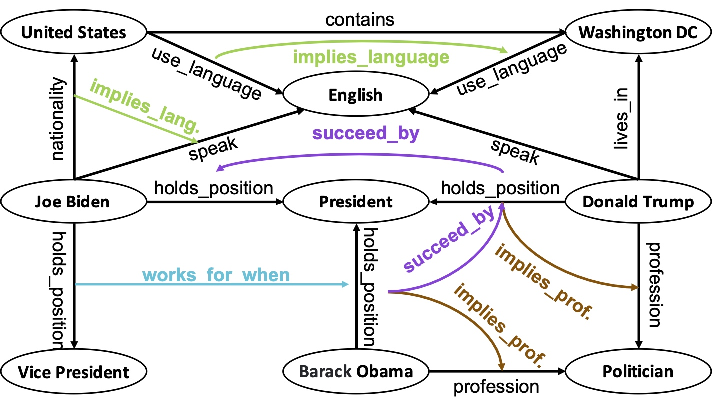

# **NestE: Modeling Nested Relational Structures for Knowledge Graph Reasoning (AAAI'24)**
[](https://docs.python.org/3.8/)
[](https://pytorch.org/docs/stable/index.html)
[](https://opensource.org/licenses/MIT)
<!-- [](https://arxiv.org/abs/2107.04894) -->


This code is a PyTorch implementation of the paper "NestE: Modeling Nested Relational Structures for Knowledge Graph Reasoning (AAAI'24)".

## What is NestE?

NestE is a knowledge graph embedding method that can encode nested facts represented by quoted triples (h,r,t) in which the subject and object are triples themselves, e.g., ((BarackObama, holds_position, President), succeed_by, (DonaldTrump, holds_position, President)).




## Abstract

This paper goes beyond atomic facts and delves into nested facts, represented by quoted triples where subjects and objects are triples themselves (e.g., ((BarackObama, holds_position, President), succeed_by, (DonaldTrump, holds_position, President))). These nested facts enable the expression of complex semantics like situations over time and logical patterns over entities and relations. 
In response, we introduce NestE, a novel KG embedding approach that captures the semantics of both atomic and nested factual knowledge. 
NestE represents each atomic fact as a $1\times3$ matrix, and each nested relation is modeled as a $3\times3$ matrix that rotates the $1\times3$ atomic fact matrix through matrix multiplication. 
Each element of the matrix is represented as a complex number in the generalized 4D hypercomplex space, including (spherical) quaternions, hyperbolic quaternions, and split-quaternions. 
Through thorough analysis, we demonstrate the embedding's efficacy in capturing diverse logical patterns over nested facts, surpassing the confines of first-order logic-like expressions. Our experimental results showcase NestE's significant performance gains over current baselines in triple prediction and conditional link prediction. 


## Installing dependencies

```
pip install -r requirements.txt
```
## Models

We implement six variant models of NetsE based on different hypercomplex number systems

NestE_Q.py: NestE with quaternion.

NestE_H.py: NestE with hyperbolic quaternion.

NestE_D.py: NestE with split quaternion.

NestE_B.py, NestE_HB.py, and NestE_DB.py are the respective version with a translation component.


## Reproducing the results of NestE and baselines


We provide all scripts with parameter settings for reproducing the results. The logs will be saved in ./logs/ folder  The results will be saved in ./results_test/ folder


Results for triple prediction on FBH 
```
nohup python bive_q.py FBH 0.1 0.1 500 --dim 200 --meta 0.5 --aug 0.2 --tp  > logs/FBH/tp/bive_q_0.1_0.1_500_200_0.5_0.2.out 2>&1 &

nohup python bive_b.py FBH 0.1 0.1 500 --dim 200 --meta 0.5 --aug 0.2 --tp  > logs/FBH/tp/bive_b_0.1_0.1_500_200_0.5_0.2.out 2>&1 &

nohup python bive_d.py FBH 0.1 0.1 500 --dim 200 --meta 0.5 --aug 0.2 --tp  > logs/FBH/tp/bive_d_0.1_0.1_500_200_0.5_0.2.out 2>&1 &

nohup python bive_db.py FBH 0.1 0.1 500 --dim 200 --meta 0.5 --aug 0.2 --tp  > logs/FBH/tp/bive_db_0.1_0.1_500_200_0.5_0.2.out 2>&1 &

nohup python bive_h.py FBH 0.1 0.1 500 --dim 200 --meta 0.5 --aug 0.2 --tp  > logs/FBH/tp/bive_h_0.1_0.1_500_200_0.5_0.2.out 2>&1 &

nohup python bive_hb.py FBH 0.1 0.1 500 --dim 200 --meta 0.5 --aug 0.2 --tp  > logs/FBH/tp/bive_hb_0.1_0.1_500_200_0.5_0.2.out 2>&1 &

nohup python neste_q.py FBH 0.1 0.1 500 --dim 200 --meta 0.5 --aug 0.2 --tp  > logs/FBH/tp/neste_q_0.1_0.1_500_200_0.5_0.2.out 2>&1 &

nohup python neste_b.py FBH 0.1 0.1 500 --dim 200 --meta 0.5 --aug 0.2 --tp  > logs/FBH/tp/neste_b_0.1_0.1_500_200_0.5_0.2.out 2>&1 &

nohup python neste_d.py FBH 0.1 0.1 500 --dim 200 --meta 0.5 --aug 0.2 --tp  > logs/FBH/tp/neste_d_0.1_0.1_500_200_0.5_0.2.out 2>&1 &

nohup python neste_db.py FBH 0.1 0.1 500 --dim 200 --meta 0.5 --aug 0.2 --tp  > logs/FBH/tp/neste_db_0.1_0.1_500_200_0.5_0.2.out 2>&1 &

nohup python neste_h.py FBH 0.1 0.1 500 --dim 200 --meta 0.5 --aug 0.2 --tp  > logs/FBH/tp/neste_h_0.1_0.1_500_200_0.5_0.2.out 2>&1 &

nohup python neste_hd.py FBH 0.1 0.1 500 --dim 200 --meta 0.5 --aug 0.2 --tp  > logs/FBH/tp/neste_hd_0.1_0.1_500_200_0.5_0.2.out 2>&1 &
```

Results for conditional link prediction on FBH 
```
nohup python bive_q.py FBH 0.1 0.1 500 --dim 200 --meta 0.5 --aug 0.2 --clp  > logs/FBH/clp/bive_q_0.1_0.1_500_200_0.5_0.2.out 2>&1 &

nohup python bive_b.py FBH 0.1 0.1 500 --dim 200 --meta 0.5 --aug 0.2 --clp  > logs/FBH/clp/bive_b_0.1_0.1_500_200_0.5_0.2.out 2>&1 &

nohup python bive_d.py FBH 0.1 0.1 500 --dim 200 --meta 0.5 --aug 0.2 --clp  > logs/FBH/clp/bive_d_0.1_0.1_500_200_0.5_0.2.out 2>&1 &

nohup python bive_db.py FBH 0.1 0.1 500 --dim 200 --meta 0.5 --aug 0.2 --clp  > logs/FBH/clp/bive_db_0.1_0.1_500_200_0.5_0.2.out 2>&1 &

nohup python bive_h.py FBH 0.1 0.1 500 --dim 200 --meta 0.5 --aug 0.2 --clp  > logs/FBH/clp/bive_h_0.1_0.1_500_200_0.5_0.2.out 2>&1 &

nohup python bive_hb.py FBH 0.1 0.1 500 --dim 200 --meta 0.5 --aug 0.2 --clp  > logs/FBH/clp/bive_hb_0.1_0.1_500_200_0.5_0.2.out 2>&1 &

nohup python neste_q.py FBH 0.1 0.1 500 --dim 200 --meta 0.5 --aug 0.2 --clp  > logs/FBH/clp/neste_q_0.1_0.1_500_200_0.5_0.2.out 2>&1 &

nohup python neste_b.py FBH 0.1 0.1 500 --dim 200 --meta 0.5 --aug 0.2 --clp  > logs/FBH/clp/neste_b_0.1_0.1_500_200_0.5_0.2.out 2>&1 &

nohup python neste_d.py FBH 0.1 0.1 500 --dim 200 --meta 0.5 --aug 0.2 --clp  > logs/FBH/clp/neste_d_0.1_0.1_500_200_0.5_0.2.out 2>&1 &

nohup python neste_db.py FBH 0.1 0.1 500 --dim 200 --meta 0.5 --aug 0.2 --clp  > logs/FBH/clp/neste_db_0.1_0.1_500_200_0.5_0.2.out 2>&1 &

nohup python neste_h.py FBH 0.1 0.1 500 --dim 200 --meta 0.5 --aug 0.2 --clp  > logs/FBH/clp/neste_h_0.1_0.1_500_200_0.5_0.2.out 2>&1 &

nohup python neste_hd.py FBH 0.1 0.1 500 --dim 200 --meta 0.5 --aug 0.2 --clp  > logs/FBH/clp/neste_hd_0.1_0.1_500_200_0.5_0.2.out 2>&1 &
```

Results for base link prediction  on FBH 
```
nohup python bive_q.py FBH 0.1 0.1 500 --dim 200 --meta 0.5 --aug 0.2 --lp  > logs/FBH/lp/bive_q_0.1_0.1_500_200_0.5_0.2.out 2>&1 &

nohup python bive_b.py FBH 0.1 0.1 500 --dim 200 --meta 0.5 --aug 0.2 --lp  > logs/FBH/lp/bive_b_0.1_0.1_500_200_0.5_0.2.out 2>&1 &

nohup python bive_d.py FBH 0.1 0.1 500 --dim 200 --meta 0.5 --aug 0.2 --lp  > logs/FBH/lp/bive_d_0.1_0.1_500_200_0.5_0.2.out 2>&1 &

nohup python bive_db.py FBH 0.1 0.1 500 --dim 200 --meta 0.5 --aug 0.2 --lp  > logs/FBH/lp/bive_db_0.1_0.1_500_200_0.5_0.2.out 2>&1 &

nohup python bive_h.py FBH 0.1 0.1 500 --dim 200 --meta 0.5 --aug 0.2 --lp  > logs/FBH/lp/bive_h_0.1_0.1_500_200_0.5_0.2.out 2>&1 &

nohup python bive_hb.py FBH 0.1 0.1 500 --dim 200 --meta 0.5 --aug 0.2 --lp  > logs/FBH/lp/bive_hb_0.1_0.1_500_200_0.5_0.2.out 2>&1 &

nohup python neste_q.py FBH 0.1 0.1 500 --dim 200 --meta 0.5 --aug 0.2 --lp  > logs/FBH/lp/neste_q_0.1_0.1_500_200_0.5_0.2.out 2>&1 &

nohup python neste_b.py FBH 0.1 0.1 500 --dim 200 --meta 0.5 --aug 0.2 --lp  > logs/FBH/lp/neste_b_0.1_0.1_500_200_0.5_0.2.out 2>&1 &

nohup python neste_d.py FBH 0.1 0.1 500 --dim 200 --meta 0.5 --aug 0.2 --lp  > logs/FBH/lp/neste_d_0.1_0.1_500_200_0.5_0.2.out 2>&1 &

nohup python neste_db.py FBH 0.1 0.1 500 --dim 200 --meta 0.5 --aug 0.2 --lp  > logs/FBH/lp/neste_db_0.1_0.1_500_200_0.5_0.2.out 2>&1 &

nohup python neste_h.py FBH 0.1 0.1 500 --dim 200 --meta 0.5 --aug 0.2 --lp  > logs/FBH/lp/neste_h_0.1_0.1_500_200_0.5_0.2.out 2>&1 &

nohup python neste_hd.py FBH 0.1 0.1 500 --dim 200 --meta 0.5 --aug 0.2 --lp  > logs/FBH/lp/neste_hd_0.1_0.1_500_200_0.5_0.2.out 2>&1 &
```

Results for triple prediction on FBHE

```
nohup python bive_q.py FBHE 0.1 0.1 500 --dim 200 --meta 0.5 --aug 0.2 --tp  > logs/FBHE/tp/bive_q_0.1_0.1_500_200_0.5_0.2.out 2>&1 &

nohup python bive_b.py FBHE 0.1 0.1 500 --dim 200 --meta 0.5 --aug 0.2 --tp  > logs/FBHE/tp/bive_b_0.1_0.1_500_200_0.5_0.2.out 2>&1 &

nohup python bive_d.py FBHE 0.1 0.1 500 --dim 200 --meta 0.5 --aug 0.2 --tp  > logs/FBHE/tp/bive_d_0.1_0.1_500_200_0.5_0.2.out 2>&1 &

nohup python bive_db.py FBHE 0.1 0.1 500 --dim 200 --meta 0.5 --aug 0.2 --tp  > logs/FBHE/tp/bive_db_0.1_0.1_500_200_0.5_0.2.out 2>&1 &

nohup python bive_h.py FBHE 0.1 0.1 500 --dim 200 --meta 0.5 --aug 0.2 --tp  > logs/FBHE/tp/bive_h_0.1_0.1_500_200_0.5_0.2.out 2>&1 &

nohup python bive_hb.py FBHE 0.1 0.1 500 --dim 200 --meta 0.5 --aug 0.2 --tp  > logs/FBHE/tp/bive_hb_0.1_0.1_500_200_0.5_0.2.out 2>&1 &

nohup python neste_q.py FBHE 0.1 0.1 500 --dim 200 --meta 0.5 --aug 0.2 --tp  > logs/FBHE/tp/neste_q_0.1_0.1_500_200_0.5_0.2.out 2>&1 &

nohup python neste_b.py FBHE 0.1 0.1 500 --dim 200 --meta 0.5 --aug 0.2 --tp  > logs/FBHE/tp/neste_b_0.1_0.1_500_200_0.5_0.2.out 2>&1 &

nohup python neste_d.py FBHE 0.1 0.1 500 --dim 200 --meta 0.5 --aug 0.2 --tp  > logs/FBHE/tp/neste_d_0.1_0.1_500_200_0.5_0.2.out 2>&1 &

nohup python neste_db.py FBHE 0.1 0.1 500 --dim 200 --meta 0.5 --aug 0.2 --tp  > logs/FBHE/tp/neste_db_0.1_0.1_500_200_0.5_0.2.out 2>&1 &

nohup python neste_h.py FBHE 0.1 0.1 500 --dim 200 --meta 0.5 --aug 0.2 --tp  > logs/FBHE/tp/neste_h_0.1_0.1_500_200_0.5_0.2.out 2>&1 &

nohup python neste_hd.py FBHE 0.1 0.1 500 --dim 200 --meta 0.5 --aug 0.2 --tp  > logs/FBHE/tp/neste_hd_0.1_0.1_500_200_0.5_0.2.out 2>&1 &
```

Results for conditional link prediction on FBHE 
```
nohup python bive_q.py FBHE 0.1 0.1 500 --dim 200 --meta 0.5 --aug 0.2 --clp  > logs/FBHE/clp/bive_q_0.1_0.1_500_200_0.5_0.2.out 2>&1 &

nohup python bive_b.py FBHE 0.1 0.1 500 --dim 200 --meta 0.5 --aug 0.2 --clp  > logs/FBHE/clp/bive_b_0.1_0.1_500_200_0.5_0.2.out 2>&1 &

nohup python bive_d.py FBHE 0.1 0.1 500 --dim 200 --meta 0.5 --aug 0.2 --clp  > logs/FBHE/clp/bive_d_0.1_0.1_500_200_0.5_0.2.out 2>&1 &

nohup python bive_db.py FBHE 0.1 0.1 500 --dim 200 --meta 0.5 --aug 0.2 --clp  > logs/FBHE/clp/bive_db_0.1_0.1_500_200_0.5_0.2.out 2>&1 &

nohup python bive_h.py FBHE 0.1 0.1 500 --dim 200 --meta 0.5 --aug 0.2 --clp  > logs/FBHE/clp/bive_h_0.1_0.1_500_200_0.5_0.2.out 2>&1 &

nohup python bive_hb.py FBHE 0.1 0.1 500 --dim 200 --meta 0.5 --aug 0.2 --clp  > logs/FBHE/clp/bive_hb_0.1_0.1_500_200_0.5_0.2.out 2>&1 &

nohup python neste_q.py FBHE 0.1 0.1 500 --dim 200 --meta 0.5 --aug 0.2 --clp  > logs/FBHE/clp/neste_q_0.1_0.1_500_200_0.5_0.2.out 2>&1 &

nohup python neste_b.py FBHE 0.1 0.1 500 --dim 200 --meta 0.5 --aug 0.2 --clp  > logs/FBHE/clp/neste_b_0.1_0.1_500_200_0.5_0.2.out 2>&1 &

nohup python neste_d.py FBHE 0.1 0.1 500 --dim 200 --meta 0.5 --aug 0.2 --clp  > logs/FBHE/clp/neste_d_0.1_0.1_500_200_0.5_0.2.out 2>&1 &

nohup python neste_db.py FBHE 0.1 0.1 500 --dim 200 --meta 0.5 --aug 0.2 --clp  > logs/FBHE/clp/neste_db_0.1_0.1_500_200_0.5_0.2.out 2>&1 &

nohup python neste_h.py FBHE 0.1 0.1 500 --dim 200 --meta 0.5 --aug 0.2 --clp  > logs/FBHE/clp/neste_h_0.1_0.1_500_200_0.5_0.2.out 2>&1 &

nohup python neste_hd.py FBHE 0.1 0.1 500 --dim 200 --meta 0.5 --aug 0.2 --clp  > logs/FBHE/clp/neste_hd_0.1_0.1_500_200_0.5_0.2.out 2>&1 &
```

Results for base link prediction  on FBH 
```
nohup python bive_q.py FBHE 0.1 0.1 500 --dim 200 --meta 0.5 --aug 0.2 --lp  > logs/FBHE/lp/bive_q_0.1_0.1_500_200_0.5_0.2.out 2>&1 &

nohup python bive_b.py FBHE 0.1 0.1 500 --dim 200 --meta 0.5 --aug 0.2 --lp  > logs/FBHE/lp/bive_b_0.1_0.1_500_200_0.5_0.2.out 2>&1 &

nohup python bive_d.py FBHE 0.1 0.1 500 --dim 200 --meta 0.5 --aug 0.2 --lp  > logs/FBHE/lp/bive_d_0.1_0.1_500_200_0.5_0.2.out 2>&1 &

nohup python bive_db.py FBHE 0.1 0.1 500 --dim 200 --meta 0.5 --aug 0.2 --lp  > logs/FBHE/lp/bive_db_0.1_0.1_500_200_0.5_0.2.out 2>&1 &

nohup python bive_h.py FBHE 0.1 0.1 500 --dim 200 --meta 0.5 --aug 0.2 --lp  > logs/FBHE/lp/bive_h_0.1_0.1_500_200_0.5_0.2.out 2>&1 &

nohup python bive_hb.py FBHE 0.1 0.1 500 --dim 200 --meta 0.5 --aug 0.2 --lp  > logs/FBHE/lp/bive_hb_0.1_0.1_500_200_0.5_0.2.out 2>&1 &

nohup python neste_q.py FBHE 0.1 0.1 500 --dim 200 --meta 0.5 --aug 0.2 --lp  > logs/FBHE/lp/neste_q_0.1_0.1_500_200_0.5_0.2.out 2>&1 &

nohup python neste_b.py FBHE 0.1 0.1 500 --dim 200 --meta 0.5 --aug 0.2 --lp  > logs/FBHE/lp/neste_b_0.1_0.1_500_200_0.5_0.2.out 2>&1 &

nohup python neste_d.py FBHE 0.1 0.1 500 --dim 200 --meta 0.5 --aug 0.2 --lp  > logs/FBHE/lp/neste_d_0.1_0.1_500_200_0.5_0.2.out 2>&1 &

nohup python neste_db.py FBHE 0.1 0.1 500 --dim 200 --meta 0.5 --aug 0.2 --lp  > logs/FBHE/lp/neste_db_0.1_0.1_500_200_0.5_0.2.out 2>&1 &

nohup python neste_h.py FBHE 0.1 0.1 500 --dim 200 --meta 0.5 --aug 0.2 --lp  > logs/FBHE/lp/neste_h_0.1_0.1_500_200_0.5_0.2.out 2>&1 &

nohup python neste_hd.py FBHE 0.1 0.1 500 --dim 200 --meta 0.5 --aug 0.2 --lp  > logs/FBHE/lp/neste_hd_0.1_0.1_500_200_0.5_0.2.out 2>&1 &
```

Results for triple prediction on DBHE

```
nohup python bive_q.py DBHE 0.1 0.1 500 --dim 200 --meta 0.5 --aug 0.2 --tp  > logs/DBHE/tp/bive_q_0.1_0.1_500_200_0.5_0.2.out 2>&1 &

nohup python bive_b.py DBHE 0.1 0.1 500 --dim 200 --meta 0.5 --aug 0.2 --tp  > logs/DBHE/tp/bive_b_0.1_0.1_500_200_0.5_0.2.out 2>&1 &

nohup python bive_d.py DBHE 0.1 0.1 500 --dim 200 --meta 0.5 --aug 0.2 --tp  > logs/DBHE/tp/bive_d_0.1_0.1_500_200_0.5_0.2.out 2>&1 &

nohup python bive_db.py DBHE 0.1 0.1 500 --dim 200 --meta 0.5 --aug 0.2 --tp  > logs/DBHE/tp/bive_db_0.1_0.1_500_200_0.5_0.2.out 2>&1 &

nohup python bive_h.py DBHE 0.1 0.1 500 --dim 200 --meta 0.5 --aug 0.2 --tp  > logs/DBHE/tp/bive_h_0.1_0.1_500_200_0.5_0.2.out 2>&1 &

nohup python bive_hb.py DBHE 0.1 0.1 500 --dim 200 --meta 0.5 --aug 0.2 --tp  > logs/DBHE/tp/bive_hb_0.1_0.1_500_200_0.5_0.2.out 2>&1 &

nohup python neste_q.py DBHE 0.1 0.1 500 --dim 200 --meta 0.5 --aug 0.2 --tp  > logs/DBHE/tp/neste_q_0.1_0.1_500_200_0.5_0.2.out 2>&1 &

nohup python neste_b.py DBHE 0.1 0.1 500 --dim 200 --meta 0.5 --aug 0.2 --tp  > logs/DBHE/tp/neste_b_0.1_0.1_500_200_0.5_0.2.out 2>&1 &

nohup python neste_d.py DBHE 0.1 0.1 500 --dim 200 --meta 0.5 --aug 0.2 --tp  > logs/DBHE/tp/neste_d_0.1_0.1_500_200_0.5_0.2.out 2>&1 &

nohup python neste_db.py DBHE 0.1 0.1 500 --dim 200 --meta 0.5 --aug 0.2 --tp  > logs/DBHE/tp/neste_db_0.1_0.1_500_200_0.5_0.2.out 2>&1 &

nohup python neste_h.py DBHE 0.1 0.1 500 --dim 200 --meta 0.5 --aug 0.2 --tp  > logs/DBHE/tp/neste_h_0.1_0.1_500_200_0.5_0.2.out 2>&1 &

nohup python neste_hd.py DBHE 0.1 0.1 500 --dim 200 --meta 0.5 --aug 0.2 --tp  > logs/DBHE/tp/neste_hd_0.1_0.1_500_200_0.5_0.2.out 2>&1 &
```

Results for conditional link prediction on DBHE
```
nohup python bive_q.py DBHE 0.1 0.1 500 --dim 200 --meta 0.5 --aug 0.2 --clp  > logs/DBHE/clp/bive_q_0.1_0.1_500_200_0.5_0.2.out 2>&1 &

nohup python bive_b.py DBHE 0.1 0.1 500 --dim 200 --meta 0.5 --aug 0.2 --clp  > logs/DBHE/clp/bive_b_0.1_0.1_500_200_0.5_0.2.out 2>&1 &

nohup python bive_d.py DBHE 0.1 0.1 500 --dim 200 --meta 0.5 --aug 0.2 --clp  > logs/DBHE/clp/bive_d_0.1_0.1_500_200_0.5_0.2.out 2>&1 &

nohup python bive_db.py DBHE 0.1 0.1 500 --dim 200 --meta 0.5 --aug 0.2 --clp  > logs/DBHE/clp/bive_db_0.1_0.1_500_200_0.5_0.2.out 2>&1 &

nohup python bive_h.py DBHE 0.1 0.1 500 --dim 200 --meta 0.5 --aug 0.2 --clp  > logs/DBHE/clp/bive_h_0.1_0.1_500_200_0.5_0.2.out 2>&1 &

nohup python bive_hb.py DBHE 0.1 0.1 500 --dim 200 --meta 0.5 --aug 0.2 --clp  > logs/DBHE/clp/bive_hb_0.1_0.1_500_200_0.5_0.2.out 2>&1 &

nohup python neste_q.py DBHE 0.1 0.1 500 --dim 200 --meta 0.5 --aug 0.2 --clp  > logs/DBHE/clp/neste_q_0.1_0.1_500_200_0.5_0.2.out 2>&1 &

nohup python neste_b.py DBHE 0.1 0.1 500 --dim 200 --meta 0.5 --aug 0.2 --clp  > logs/DBHE/clp/neste_b_0.1_0.1_500_200_0.5_0.2.out 2>&1 &

nohup python neste_d.py DBHE 0.1 0.1 500 --dim 200 --meta 0.5 --aug 0.2 --clp  > logs/DBHE/clp/neste_d_0.1_0.1_500_200_0.5_0.2.out 2>&1 &

nohup python neste_db.py DBHE 0.1 0.1 500 --dim 200 --meta 0.5 --aug 0.2 --clp  > logs/DBHE/clp/neste_db_0.1_0.1_500_200_0.5_0.2.out 2>&1 &

nohup python neste_h.py DBHE 0.1 0.1 500 --dim 200 --meta 0.5 --aug 0.2 --clp  > logs/DBHE/clp/neste_h_0.1_0.1_500_200_0.5_0.2.out 2>&1 &

nohup python neste_hd.py DBHE 0.1 0.1 500 --dim 200 --meta 0.5 --aug 0.2 --clp  > logs/DBHE/clp/neste_hd_0.1_0.1_500_200_0.5_0.2.out 2>&1 &
```


Results for base link prediction on DBHE

```
nohup python bive_q.py DBHE 0.1 0.1 500 --dim 200 --meta 0.5 --aug 0.2 --lp  > logs/DBHE/lp/bive_q_0.1_0.1_500_200_0.5_0.2.out 2>&1 &

nohup python bive_b.py DBHE 0.1 0.1 500 --dim 200 --meta 0.5 --aug 0.2 --lp  > logs/DBHE/lp/bive_b_0.1_0.1_500_200_0.5_0.2.out 2>&1 &

nohup python bive_d.py DBHE 0.1 0.1 500 --dim 200 --meta 0.5 --aug 0.2 --lp  > logs/DBHE/lp/bive_d_0.1_0.1_500_200_0.5_0.2.out 2>&1 &

nohup python bive_db.py DBHE 0.1 0.1 500 --dim 200 --meta 0.5 --aug 0.2 --lp  > logs/DBHE/lp/bive_db_0.1_0.1_500_200_0.5_0.2.out 2>&1 &

nohup python bive_h.py DBHE 0.1 0.1 500 --dim 200 --meta 0.5 --aug 0.2 --lp  > logs/DBHE/lp/bive_h_0.1_0.1_500_200_0.5_0.2.out 2>&1 &

nohup python bive_hb.py DBHE 0.1 0.1 500 --dim 200 --meta 0.5 --aug 0.2 --lp  > logs/DBHE/lp/bive_hb_0.1_0.1_500_200_0.5_0.2.out 2>&1 &

nohup python neste_q.py DBHE 0.1 0.1 500 --dim 200 --meta 0.5 --aug 0.2 --lp  > logs/DBHE/lp/neste_q_0.1_0.1_500_200_0.5_0.2.out 2>&1 &

nohup python neste_b.py DBHE 0.1 0.1 500 --dim 200 --meta 0.5 --aug 0.2 --lp  > logs/DBHE/lp/neste_b_0.1_0.1_500_200_0.5_0.2.out 2>&1 &

nohup python neste_d.py DBHE 0.1 0.1 500 --dim 200 --meta 0.5 --aug 0.2 --lp  > logs/DBHE/lp/neste_d_0.1_0.1_500_200_0.5_0.2.out 2>&1 &

nohup python neste_db.py DBHE 0.1 0.1 500 --dim 200 --meta 0.5 --aug 0.2 --lp  > logs/DBHE/lp/neste_db_0.1_0.1_500_200_0.5_0.2.out 2>&1 &

nohup python neste_h.py DBHE 0.1 0.1 500 --dim 200 --meta 0.5 --aug 0.2 --lp  > logs/DBHE/lp/neste_h_0.1_0.1_500_200_0.5_0.2.out 2>&1 &

nohup python neste_hd.py DBHE 0.1 0.1 500 --dim 200 --meta 0.5 --aug 0.2 --lp  > logs/DBHE/lp/neste_hd_0.1_0.1_500_200_0.5_0.2.out 2>&1 &
```

###  DBHE relation-specifc results

To obtain the relation-specifc results, simply use the relation-specifc test sets in ./bechmarks/DBHE/meta_i (where i is the i_th relation). 


## Pre-trained models

We provided some [pre-trained models]()  for testing the results without training (Note: in this folder, MetaE means NestE)


## Some of the code was forked from the following repositories

Our code is forked from BiVE and is based on OpenKE. Thanks to the authors for opening their code and data

 * [BiVE](https://github.com/bdi-lab/BiVE)
 * [OpenKE](https://github.com/thunlp/OpenKE)


## Citation

If you find this code useful, please cite the following paper: 
```
@inproceedings{xiong_neste_aaai24,
  title = {NestE: Modeling Nested Relational Structures for Knowledge Graph Reasoning},
  author = {Xiong, Bo and Nayyeri, Mojtaba and Luo, Linhao and Wang, Zihao and Pan, Shirui and Staab, Steffen},
  year = {2024},
  pages = {},
  booktitle = {The 38th Annual AAAI Conference on Artificial Intelligence}
}
```